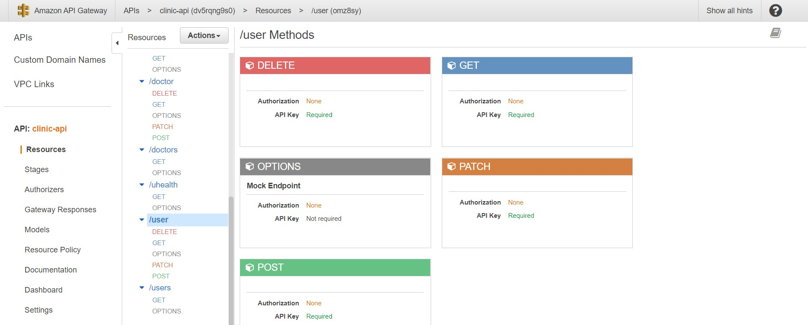

# Clinic REST-API
Use following things

- Node.js
- AWS Lambda
- AWS API Gateway
- AWS APIGateway API Key (For Restrict API Access)
- AWS DynamoDB
- AWS CodePipeline
- AWS CodeBuild
- AWS IAM Roles & Policy
- Github Repository

See [Postman Collection](https://www.getpostman.com/collections/7e39f4cd409ca8296420) you can Import Collection via link for Invoke APIs.
Colection Link - https://www.getpostman.com/collections/7e39f4cd409ca8296420

Architectural Diagram


# Create Lambda functions

Create 4 Lambda functions with permisson with DynamoDB


Add following permisson to IAM Role
- AmazonDynamoDBFullAccess	
- CloudWatchLogsFullAccess

# Create API Gateway

Create AWS API GAteway and add following routes


# Create DynamoDB Tables


Create 4 dynamodb tables for
- user
- admin
- doctor
- appointments

## Create AWS CodeBuild Build Project

For CICD pipeline create a CodeBuild Project


CodeBuild Service role add following code part
```
{
  "Effect": "Allow",
  "Action": [
      "lambda:AddPermission",
      "lambda:RemovePermission",
      "lambda:CreateAlias",
      "lambda:UpdateAlias",
      "lambda:DeleteAlias",
      "lambda:UpdateFunctionCode",
      "lambda:UpdateFunctionConfiguration",
      "lambda:PutFunctionConcurrency",
      "lambda:DeleteFunctionConcurrency",
      "lambda:PublishVersion"
  ],
  "Resource": [
    "arn:aws:lambda:{{region}}:{{accountno}}:function:{{user-bucket}}",
    "arn:aws:lambda:{{region}}:{{accountno}}:function:{{admin-bucket}}",
    "arn:aws:lambda:{{region}}:{{accountno}}:function:{{doctor-bucket}}",
    "arn:aws:lambda:{{region}}:{{accountno}}:function:{{appointment-bucket}}"
]
}
```
Create buildspec.yml, add content and push to repository

# Create CodePipeline

Create AWS CodePipeline for CICD process


# Deploy API Gateway stage

We can create 4 stages for Dev, QA, UAT, Prod


# Check API using Postman or Curl


Response


Test Result


curl {{Invoke-URL}}
Ex: curl https://dv5rqng9s0.execute-api.us-east-2.amazonaws.com/Development/admins

You can add Postman collection [Postman Collection](https://www.getpostman.com/collections/7e39f4cd409ca8296420)

Add API key : x-api-key(Q2gZ5ArllY8bWlqSzA0eS6JmxMibVYUU8kgca1RU)

Thank You!